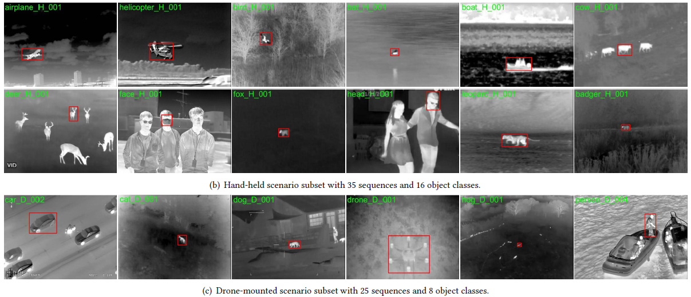
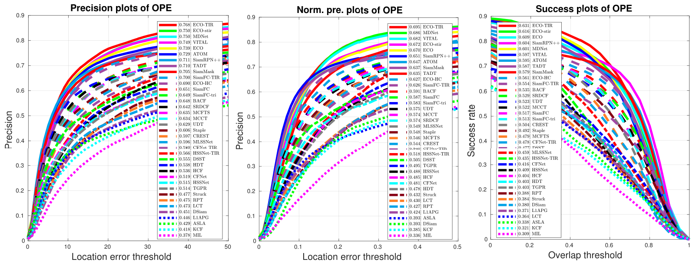

## LSOTB-TIR:  A Large-Scale High-Diversity Thermal Infrared Object Tracking Benchmark 
This toolkit is used to evaluate general thermal infrared (TIR) trackers on the TIR object tracking benchmark, LSOTB-TIR, which consists of a large-scale training dataset and an evaluation dataset with a total of 1,400 TIR image sequences and more than 600K frames. To evaluate a TIR tracker on different attributes, we define 4 scenario attributes and 12 challenge attributes in the evaluation dataset. By releasing LSOTB-TIR, we encourage the community to develop deep learning based TIR trackers and evaluate them fairly and comprehensively. 
[Paper](https://www.researchgate.net/publication/343384216_LSOTB-TIR_A_Large-Scale_High-Diversity_Thermal_Infrared_Object_Tracking_Benchmark), [Supplementary materials](https://www.researchgate.net/publication/343384184_LSOTB-TIR-supplementary_materialspdf)

## News
* Our paper is accepted by ACM Multimedia Conference 2020. 
## Characteristics
* Large-scale: 1400 TIR sequences, 600K+ frames, 730K+ bounding boxes.
* High-diversity: 12 challenges, 4 scenario, 47 object classes.
* Contain both training and evaluation data sets.
* Provide 30+ tracker's evaluation results.
## Download dataset and evaluation results
* Download the **training dataset** from [here](https://mega.nz/folder/gkwCHQwB#xiUmcpLnw98OzKmv_BRU0g) and **evaluation dataset** from [here](https://mega.nz/file/k1hH0LKQ#SHFtKtph36TSEB1Mevw1Wymk2Rh5Hg7V4ZYwGY_V-IU).
* Download 30+ tracker's evaluation raw results from [here](https://mega.nz/file/8t4hmbbR#-j4-LNSyKTuYgiZo1skB3i5sWOWagXhykgQm1_az-vs).
## Usage
1. Download the evaluation dataset and put it into the `sequences` folder.
2. Download the evaluation raw results and put them into the `results`  folder.
3. Run `run_evaluation.m` and `run_speed.m` to draw the result plots.
4. Configure `configTrackers.m` and then use `main_running_one.m`  to run your own tracker on the benchmark.
## Result's plots

## Trackers and codes
### TIR trackers
* **MMNet.**  Liu Q, et al. Multi-task driven feature model for thermal infrared tracking, AAAI, 2020. [[Github]](https://github.com/QiaoLiuHit/MMNet)
* **ECO-stir.**  Zhang L, et al. Synthetic data generation for end-to-end thermal infrared tracking, TIP, 2019. [[Github]](https://github.com/zhanglichao/generatedTIR_tracking)
*  **MLSSNet.** Liu Q, et al, Learning Deep Multi-Level Similarity for Thermal Infrared Object Tracking, TMM, 2020. [[Paper]](https://arxiv.org/abs/1906.03568)
*  **HSSNet.**  Li X, et al, Hierarchical spatial-aware Siamese network for thermal infrared object tracking, KBS, 2019.[[Github]](https://github.com/QiaoLiuHit/HSSNet)
*  **MCFTS.** Liu Q, et al, Deep convolutional neural networks for thermal infrared object tracking, KBS, 2017. [[Github]](https://github.com/QiaoLiuHit/MCFTS) 
### RGB trackers
* **ECO.** Danelljan M, et al, ECO: efficient convolution operators for tracking, CVPR, 2017. [[Github]](https://github.com/martin-danelljan/ECO)
*  **DeepSTRCF.** Li F et al, Learning spatial-temporal regularized correlation filters for visual tracking, CVPR, 2018. [[Github]](https://github.com/lifeng9472/STRCF)
*  **MDNet.** Nam H, et al, Learning multi-domain convolutional neural networks for visual tracking, CVPR, 2016. [[Github]](https://github.com/hyeonseobnam/MDNet)
* **SRDCF.**  Danelljan M, et al, Learning spatially regularized correlation filters for visual tracking, ICCV, 2015. [[Project]](https://www.cvl.isy.liu.se/research/objrec/visualtracking/regvistrack/)
* **VITAL.** Song Y, et al., Vital: Visual tracking via adversarial learning, CVPR, 2018. [[Github]](https://github.com/ybsong00/Vital_release)
* **TADT.** Li X, et al, Target-aware deep tracking, CVPR, 2019. [[Github]](https://github.com/XinLi-zn/TADT)
* **MCCT.** Wang N, et al, Multi-cue correlation filters for robust visual tracking, CVPR, 2018. [[Github]](https://github.com/594422814/MCCT)
* **Staple.** Bertinetto, L, et al, Staple: Complementary learners for real-time tracking, CVPR, 2016. [[Github]](https://github.com/bertinetto/staple)
* **DSST.** Danelljan M, et al, Accurate scale estimation for robust visual tracking, BMVC, 2014. [[Github]](https://github.com/gnebehay/DSST)
* **UDT.** Wang N, et al, Unsupervised deep tracking, CVPR, 2019. [[Github]](https://github.com/594422814/UDT)
* **CREST.** Song Y, et al, Crest: Convolutional residual learning for visual tracking, ICCV, 2017. [[Github]](https://github.com/ybsong00/CREST-Release)
*  **SiamFC.** Bertinetto, L, et al, Fully-Convolutional Siamese Networks for Object Tracking, ECCVW, 2016. [[Github]](https://github.com/bertinetto/siamese-fc)
*  **SiamFC-tri.** Dong X, et al, Triplet loss in Siamese network for object tracking, ECCV, 2018. [[Github]](https://github.com/shenjianbing/TripletTracking)
*  **HDT.** Qi Y, et al, Hedged deep tracking, CVPR, 2016. [[Project]](https://sites.google.com/site/yuankiqi/hdt/)
*  **CFNet.**  Valmadre, J, et al,  End-to-end representation learning for correlation filter based tracking, CVPR, 2017. [[Github]](https://github.com/bertinetto/cfnet)
*   **HCF.** Ma, C, et al, Hierarchical convolutional features for visual tracking, ICCV, 2015. [[Github]](https://github.com/jbhuang0604/CF2)
*   **L1APG.** Bao, C, et al,  Real time robust L1 tracker using accelerated proximal gradient approach, CVPR, 2012. [[Project]](http://www.dabi.temple.edu/~hbling/code_data.htm)
*  **SVM.** Wang N, et al, Understanding and diagnosing visual tracking systems, ICCV, 2015. [[Project]](http://winsty.net/tracker_diagnose.html)
*  **KCF.** Henriques, J, et al, High-speed tracking with kernelized correlation filters, TPAMI, 2015. [[Project]](http://www.robots.ox.ac.uk/~joao/circulant/)
*  **DSiam.** Guo, Q, et al, Learning dynamic siamese network for visual object tracking, ICCV, 2017. [[Github]](https://github.com/tsingqguo/DSiam)
## Contact
Feedbacks and comments are welcome! 
Feel free to contact us via liuqiao.hit@gmail.com or liuqiao@stu.hit.edu.cn
